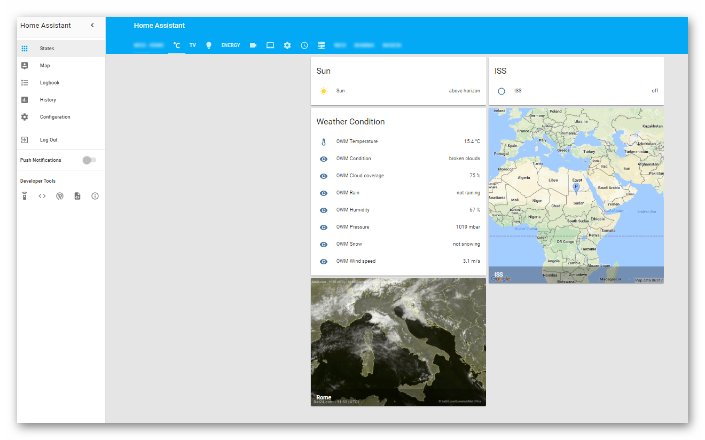
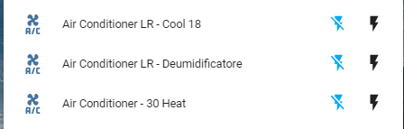
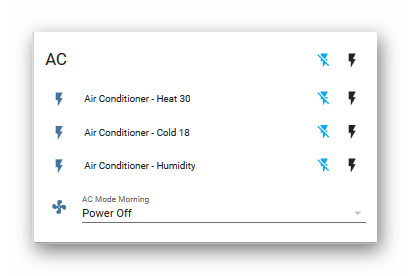
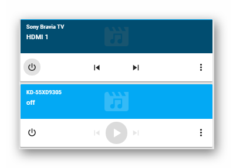
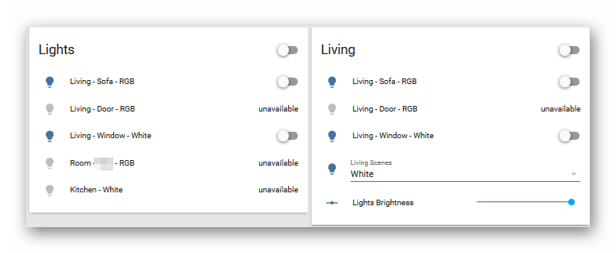
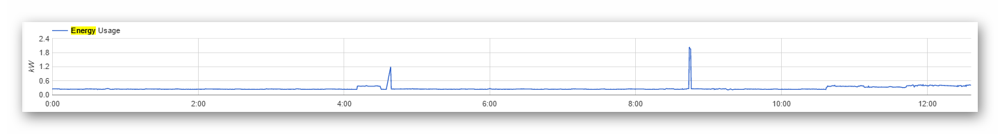
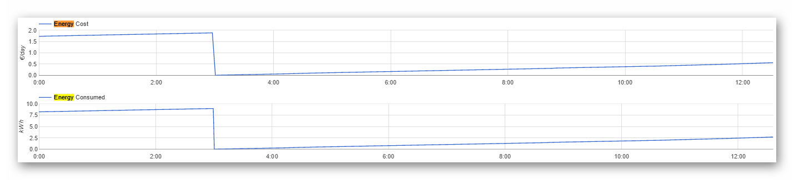
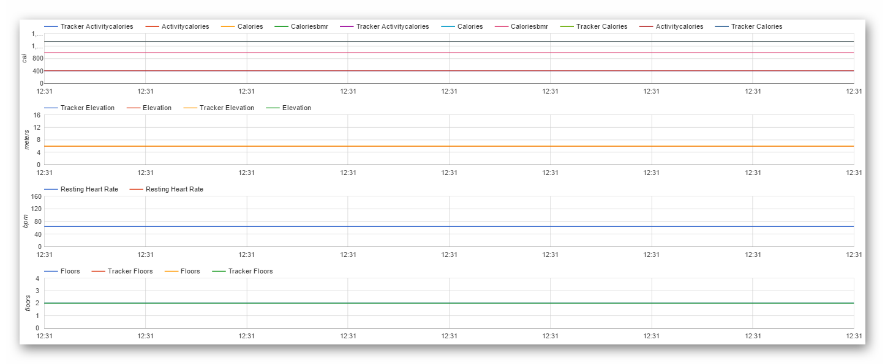
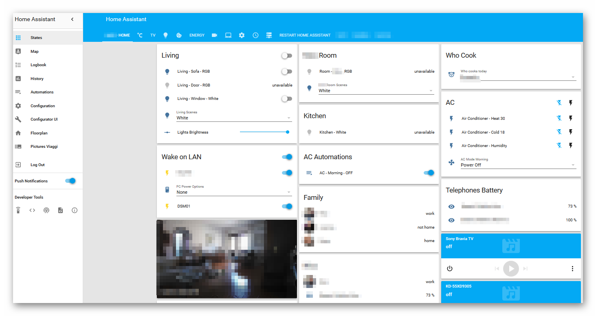

# Homeassistant Template Example By Nicolò Steffè

Home assistant Configuration (YAMLs)

This is my Home Assistant Configuration created with Raspberry Pi3 with Hassio.

- Alexa voice command integrated with haaska https://github.com/mike-grant/haaska/wiki
- Android Devices (iPads, iPods, iPhones)
- Owntracks for presence detection and GPS logging

- Mitsubishi Air Conditioner and Belkin IR Blaster - Mini R3

.   
.   

- Sony Bravia Android TV and Chromecast TV 

.   

- Alexa Media Player

- Fritbox and Presence detection

- Synology NAS
- Reolink E1 Pro

- Shelly Devices

- Yeelight RGB and White Bulb and Hass Scenes

- Efergy for Energy cost monitor

- Telegram Notification
- FitBit Integration

- Active Weather Map and International Space Station Integration

- View Example

